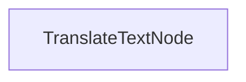

# 批量翻译过程

该项目展示了一个批量处理实现，可以同时将文档翻译成多种语言。它旨在高效处理markdown文件的翻译，同时保持格式。

## 功能

- 并行将markdown内容翻译成多种语言
- 将翻译后的文件保存到指定的输出目录

## 开始使用

1. 安装所需的软件包：
```bash
pip install -r requirements.txt
```

2. 设置你的API密钥：
```bash
export ANTHROPIC_API_KEY="your-api-key-here"
```

3. 运行翻译过程：
```bash
python main.py
```

## 工作原理

实现使用了一个 `TranslateTextNode` 来处理翻译请求的批量：



`TranslateTextNode`：
1. 准备多语言翻译的批次
2. 使用模型并行执行翻译
3. 将翻译后的内容保存到单个文件中
4. 保持原始markdown结构

这种方法展示了PocketFlow如何高效地并行处理多个相关任务。

## 示例输出

当你运行翻译过程时，你将看到类似于以下的输出：

```
翻译的中文文本
翻译的西班牙文本
翻译的日文文本
翻译的德文文本
翻译的俄文文本
翻译的葡萄牙文本
翻译的法文文本
翻译的韩文文本
将翻译保存到 translations/README_CHINESE.md
将翻译保存到 translations/README_SPANISH.md
将翻译保存到 translations/README_JAPANESE.md
将翻译保存到 translations/README_GERMAN.md
将翻译保存到 translations/README_RUSSIAN.md
将翻译保存到 translations/README_PORTUGUESE.md
将翻译保存到 translations/README_FRENCH.md
将翻译保存到 translations/README_KOREAN.md

=== 翻译完成 ===
翻译已保存到：translations
============================
```

## 文件

- [`main.py`](./main.py): 批量翻译节点的实现
- [`utils.py`](./utils.py): 调用Anthropic模型的简单包装器
- [`requirements.txt`](./requirements.txt): 项目依赖项

翻译内容保存在 `translations` 目录中，每个文件根据目标语言命名。