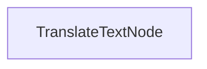

<<<<<<< HEAD
# Processus de Traduction en Batch

Ce projet démontre une implémentation de traitement en batch qui permet aux LLMs de traduire des documents dans plusieurs langues simultanément. Il est conçu pour gérer efficacement la traduction de fichiers markdown tout en préservant la mise en forme.
=======
<div align="center">
  
</div>

<!-- [English](https://github.com/The-Pocket/PocketFlow/blob/main/README.md) -->

[English](https://github.com/The-Pocket/PocketFlow/blob/main/README.md) | [中文](https://github.com/The-Pocket/PocketFlow/blob/main/cookbook/pocketflow-batch/translations/README_CHINESE.md) | [Español](https://github.com/The-Pocket/PocketFlow/blob/main/cookbook/pocketflow-batch/translations/README_SPANISH.md) | [日本語](https://github.com/The-Pocket/PocketFlow/blob/main/cookbook/pocketflow-batch/translations/README_JAPANESE.md) | [Deutsch](https://github.com/The-Pocket/PocketFlow/blob/main/cookbook/pocketflow-batch/translations/README_GERMAN.md) | [Русский](https://github.com/The-Pocket/PocketFlow/blob/main/cookbook/pocketflow-batch/translations/README_RUSSIAN.md) | [Português](https://github.com/The-Pocket/PocketFlow/blob/main/cookbook/pocketflow-batch/translations/README_PORTUGUESE.md) | Français | [한국어](https://github.com/The-Pocket/PocketFlow/blob/main/cookbook/pocketflow-batch/translations/README_KOREAN.md)
>>>>>>> 5e3b529b8f8440220020c1bde2b1fb017e12d342

## Fonctionnalités

<<<<<<< HEAD
- Traduit le contenu markdown dans plusieurs langues en parallèle
- Enregistre les fichiers traduits dans un répertoire de sortie spécifié

## Mise en route

1. Installez les packages requis :
```bash
pip install -r requirements.txt
```

2. Configurez votre clé API :
```bash
export ANTHROPIC_API_KEY="votre-clé-api-ici"
```

3. Exécutez le processus de traduction :
```bash
python main.py
```
=======
Pocket Flow est un framework LLM minimaliste en [100 lignes](https://github.com/The-Pocket/PocketFlow/blob/main/pocketflow/__init__.py)

- **Léger** : Seulement 100 lignes. Zéro superflu, zéro dépendance, zéro verrouillage fournisseur.
  
- **Expressif** : Tout ce que vous aimez — ([Multi-](https://the-pocket.github.io/PocketFlow/design_pattern/multi_agent.html))[Agents](https://the-pocket.github.io/PocketFlow/design_pattern/agent.html), [Workflow](https://the-pocket.github.io/PocketFlow/design_pattern/workflow.html), [RAG](https://the-pocket.github.io/PocketFlow/design_pattern/rag.html), et plus encore.

- **[Programmation Agentique](https://zacharyhuang.substack.com/p/agentic-coding-the-most-fun-way-to)** : Laissez les Agents IA (par exemple, Cursor AI) créer des Agents — augmentez votre productivité par 10 !

Commencer avec Pocket Flow :
- Pour installer, ```pip install pocketflow``` ou copiez simplement le [code source](https://github.com/The-Pocket/PocketFlow/blob/main/pocketflow/__init__.py) (seulement 100 lignes).
- Pour en savoir plus, consultez la [documentation](https://the-pocket.github.io/PocketFlow/). Pour comprendre la motivation, lisez l'[histoire](https://zacharyhuang.substack.com/p/i-built-an-llm-framework-in-just).
- Des questions ? Consultez cet [Assistant IA](https://chatgpt.com/g/g-677464af36588191b9eba4901946557b-pocket-flow-assistant), ou [créez une issue !](https://github.com/The-Pocket/PocketFlow/issues/new)
- 🎉 Rejoignez notre [Discord](https://discord.gg/hUHHE9Sa6T) pour vous connecter avec d'autres développeurs utilisant Pocket Flow !
- 🎉 Pocket Flow est initialement en Python, mais nous avons maintenant des versions en [Typescript](https://github.com/The-Pocket/PocketFlow-Typescript), [Java](https://github.com/The-Pocket/PocketFlow-Java), [C++](https://github.com/The-Pocket/PocketFlow-CPP) et [Go](https://github.com/The-Pocket/PocketFlow-Go) !
>>>>>>> 5e3b529b8f8440220020c1bde2b1fb017e12d342

## Fonctionnement

L'implémentation utilise un `TranslateTextNode` qui traite des lots de requêtes de traduction :



Le `TranslateTextNode` :
1. Prépare des lots pour des traductions dans plusieurs langues
2. Exécute les traductions en parallèle en utilisant le modèle
3. Enregistre le contenu traduit dans des fichiers individuels
4. Maintient la structure d'origine du markdown

Cette approche illustre comment PocketFlow peut traiter efficacement plusieurs tâches connexes en parallèle.

## Exemple de sortie

Lorsque vous exécutez le processus de traduction, vous verrez une sortie similaire à celle-ci :

<<<<<<< HEAD
```
Texte traduit en chinois
Texte traduit en espagnol
Texte traduit en japonais
Texte traduit en allemand
Texte traduit en russe
Texte traduit en portugais
Texte traduit en français
Texte traduit en coréen
Traduction enregistrée dans translations/README_CHINESE.md
Traduction enregistrée dans translations/README_SPANISH.md
Traduction enregistrée dans translations/README_JAPANESE.md
Traduction enregistrée dans translations/README_GERMAN.md
Traduction enregistrée dans translations/README_RUSSIAN.md
Traduction enregistrée dans translations/README_PORTUGUESE.md
Traduction enregistrée dans translations/README_FRENCH.md
Traduction enregistrée dans translations/README_KOREAN.md

=== Traduction terminée ===
Traductions enregistrées dans : translations
============================
```

## Fichiers
=======
Les [100 lignes](https://github.com/The-Pocket/PocketFlow/blob/main/pocketflow/__init__.py) capturent l'abstraction fondamentale des frameworks LLM : le Graph !
<br>
<div align="center">
  
</div>
<br>

De là, il est facile d'implémenter des modèles de conception populaires comme ([Multi-](https://the-pocket.github.io/PocketFlow/design_pattern/multi_agent.html))[Agents](https://the-pocket.github.io/PocketFlow/design_pattern/agent.html), [Workflow](https://the-pocket.github.io/PocketFlow/design_pattern/workflow.html), [RAG](https://the-pocket.github.io/PocketFlow/design_pattern/rag.html), etc.
<br>
<div align="center">
  
</div>
<br>
✨ Voici des tutoriels de base :

<div align="center">
  
|  Nom  | Difficulté    |  Description  |  
| :-------------:  | :-------------: | :--------------------- |  
| [Chat](https://github.com/The-Pocket/PocketFlow/tree/main/cookbook/pocketflow-chat) | ☆☆☆ <br> *Débutant*   | Un chatbot basique avec historique de conversation |
| [Sortie Structurée](https://github.com/The-Pocket/PocketFlow/tree/main/cookbook/pocketflow-structured-output) | ☆☆☆ <br> *Débutant* | Extraction de données structurées à partir de CV par prompt |
| [Workflow](https://github.com/The-Pocket/PocketFlow/tree/main/cookbook/pocketflow-workflow) | ☆☆☆ <br> *Débutant*   | Un workflow d'écriture qui planifie, rédige du contenu et applique un style |
| [Agent](https://github.com/The-Pocket/PocketFlow/tree/main/cookbook/pocketflow-agent) | ☆☆☆ <br> *Débutant*   | Un agent de recherche qui peut chercher sur le web et répondre aux questions |
| [RAG](https://github.com/The-Pocket/PocketFlow/tree/main/cookbook/pocketflow-rag) | ☆☆☆ <br> *Débutant*   | Un processus simple de génération augmentée par récupération |
| [Batch](https://github.com/The-Pocket/PocketFlow/tree/main/cookbook/pocketflow-batch) | ☆☆☆ <br> *Débutant* | Un processeur par lots qui traduit du contenu markdown en plusieurs langues |
| [Streaming](https://github.com/The-Pocket/PocketFlow/tree/main/cookbook/pocketflow-llm-streaming) | ☆☆☆ <br> *Débutant*   | Une démo de streaming LLM en temps réel avec capacité d'interruption utilisateur |
| [Garde-fou de Chat](https://github.com/The-Pocket/PocketFlow/tree/main/cookbook/pocketflow-chat-guardrail) | ☆☆☆ <br> *Débutant*  | Un chatbot conseiller de voyage qui ne traite que les requêtes liées au voyage |
| [Map-Reduce](https://github.com/The-Pocket/PocketFlow/tree/main/cookbook/pocketflow-map-reduce) | ★☆☆ <br> *Intermédiaire* | Un processeur de qualification de CV utilisant le modèle map-reduce pour l'évaluation par lots |
| [Multi-Agent](https://github.com/The-Pocket/PocketFlow/tree/main/cookbook/pocketflow-multi-agent) | ★☆☆ <br> *Intermédiaire* | Un jeu de Tabou pour la communication asynchrone entre deux agents |
| [Superviseur](https://github.com/The-Pocket/PocketFlow/tree/main/cookbook/pocketflow-supervisor) | ★☆☆ <br> *Intermédiaire* | L'agent de recherche devient peu fiable... Construisons un processus de supervision |
| [Parallèle](https://github.com/The-Pocket/PocketFlow/tree/main/cookbook/pocketflow-parallel-batch) | ★☆☆ <br> *Intermédiaire*   | Une démo d'exécution parallèle montrant une accélération de 3x |
| [Flux Parallèle](https://github.com/The-Pocket/PocketFlow/tree/main/cookbook/pocketflow-parallel-batch-flow) | ★☆☆ <br> *Intermédiaire*   | Une démo de traitement d'image parallèle montrant une accélération de 8x avec plusieurs filtres |
| [Vote Majoritaire](https://github.com/The-Pocket/PocketFlow/tree/main/cookbook/pocketflow-majority-vote) | ★☆☆ <br> *Intermédiaire* | Améliorer la précision du raisonnement en agrégeant plusieurs tentatives de solution |
| [Réflexion](https://github.com/The-Pocket/PocketFlow/tree/main/cookbook/pocketflow-thinking) | ★☆☆ <br> *Intermédiaire*   | Résoudre des problèmes de raisonnement complexes grâce à la Chaîne de Pensée |
| [Mémoire](https://github.com/The-Pocket/PocketFlow/tree/main/cookbook/pocketflow-chat-memory) | ★☆☆ <br> *Intermédiaire* | Un chatbot avec mémoire à court et long terme |
| [Text2SQL](https://github.com/The-Pocket/PocketFlow/tree/main/cookbook/pocketflow-text2sql) | ★☆☆ <br> *Intermédiaire* | Convertir le langage naturel en requêtes SQL avec une boucle d'auto-débogage |
| [MCP](https://github.com/The-Pocket/PocketFlow/tree/main/cookbook/pocketflow-mcp) | ★☆☆ <br> *Intermédiaire* |  Agent utilisant le Protocole de Contexte de Modèle pour les opérations numériques |
| [A2A](https://github.com/The-Pocket/PocketFlow/tree/main/cookbook/pocketflow-a2a) | ★☆☆ <br> *Intermédiaire* | Agent encapsulé avec le protocole Agent-to-Agent pour la communication inter-agent |
| [Web HITL](https://github.com/The-Pocket/PocketFlow/tree/main/cookbook/pocketflow-web-hitl) | ★☆☆ <br> *Intermédiaire* | Un service web minimal pour une boucle de révision humaine avec mises à jour SSE |
>>>>>>> 5e3b529b8f8440220020c1bde2b1fb017e12d342

- [`main.py`](./main.py): Implémentation du nœud de traduction en batch
- [`utils.py`](./utils.py): Enveloppe simple pour appeler le modèle Anthropic
- [`requirements.txt`](./requirements.txt): Dépendances du projet

<<<<<<< HEAD
Les traductions sont enregistrées dans le répertoire `translations`, chaque fichier étant nommé selon la langue cible.
=======
👀 Vous voulez voir d'autres tutoriels pour débutants ? [Créez une issue !](https://github.com/The-Pocket/PocketFlow/issues/new)

## Comment utiliser Pocket Flow ?

🚀 Par la **Programmation Agentique** — le paradigme de développement d'applications LLM le plus rapide — où *les humains conçoivent* et *les agents programment* !

<br>
<div align="center">
  <a href="https://zacharyhuang.substack.com/p/agentic-coding-the-most-fun-way-to" target="_blank">
    
  </a>
</div>
<br>

✨ Voici des exemples d'applications LLM plus complexes :

<div align="center">
  
|  Nom de l'application     |  Difficulté    | Sujets  | Conception Humaine | Code Agent |
| :-------------:  | :-------------: | :---------------------: |  :---: |  :---: |
| [Construire Cursor avec Cursor](https://github.com/The-Pocket/Tutorial-Cursor) <br> <sup><sub>Nous atteindrons bientôt la singularité ...</sup></sub> | ★★★ <br> *Avancé*   | [Agent](https://the-pocket.github.io/PocketFlow/design_pattern/agent.html) | [Document de conception](https://github.com/The-Pocket/Tutorial-Cursor/blob/main/docs/design.md) | [Code Flow](https://github.com/The-Pocket/Tutorial-Cursor/blob/main/flow.py)
| [Constructeur de Connaissances de Base de Code](https://github.com/The-Pocket/Tutorial-Codebase-Knowledge) <br> <sup><sub>La vie est trop courte pour rester perplexe devant le code des autres</sup></sub> |  ★★☆ <br> *Moyen* | [Workflow](https://the-pocket.github.io/PocketFlow/design_pattern/workflow.html) | [Document de conception](https://github.com/The-Pocket/Tutorial-Codebase-Knowledge/blob/main/docs/design.md) | [Code Flow](https://github.com/The-Pocket/Tutorial-Codebase-Knowledge/blob/main/flow.py)
| [Interroger l'IA Paul Graham](https://github.com/The-Pocket/Tutorial-YC-Partner) <br> <sup><sub>Interrogez l'IA Paul Graham, au cas où vous ne seriez pas accepté</sup></sub> | ★★☆ <br> *Moyen*  | [RAG](https://the-pocket.github.io/PocketFlow/design_pattern/rag.html) <br> [Map Reduce](https://the-pocket.github.io/PocketFlow/design_pattern/mapreduce.html) <br> [TTS](https://the-pocket.github.io/PocketFlow/utility_function/text_to_speech.html) | [Document de conception](https://github.com/The-Pocket/Tutorial-AI-Paul-Graham/blob/main/docs/design.md) | [Code Flow](https://github.com/The-Pocket/Tutorial-AI-Paul-Graham/blob/main/flow.py)
| [Résumeur Youtube](https://github.com/The-Pocket/Tutorial-Youtube-Made-Simple)  <br> <sup><sub> Vous explique les vidéos YouTube comme si vous aviez 5 ans </sup></sub> | ★☆☆ <br> *Intermédiaire*   | [Map Reduce](https://the-pocket.github.io/PocketFlow/design_pattern/mapreduce.html) |  [Document de conception](https://github.com/The-Pocket/Tutorial-Youtube-Made-Simple/blob/main/docs/design.md) | [Code Flow](https://github.com/The-Pocket/Tutorial-Youtube-Made-Simple/blob/main/flow.py)
| [Générateur d'Accroche pour Email](https://github.com/The-Pocket/Tutorial-Cold-Email-Personalization)  <br> <sup><sub> Des brise-glaces instantanés qui transforment les prospects froids en prospects chauds </sup></sub> | ★☆☆ <br> *Intermédiaire*   | [Map Reduce](https://the-pocket.github.io/PocketFlow/design_pattern/mapreduce.html) <br> [Recherche Web](https://the-pocket.github.io/PocketFlow/utility_function/websearch.html) |  [Document de conception](https://github.com/The-Pocket/Tutorial-Cold-Email-Personalization/blob/master/docs/design.md) | [Code Flow](https://github.com/The-Pocket/Tutorial-Cold-Email-Personalization/blob/master/flow.py)

</div>

- Vous voulez apprendre la **Programmation Agentique** ?

  - Consultez [ma chaîne YouTube](https://www.youtube.com/@ZacharyLLM?sub_confirmation=1) pour des tutoriels vidéo sur la façon dont certaines applications ci-dessus sont créées !

  - Vous voulez créer votre propre application LLM ? Lisez cet [article](https://zacharyhuang.substack.com/p/agentic-coding-the-most-fun-way-to) ! Commencez avec [ce modèle](https://github.com/The-Pocket/PocketFlow-Template-Python) !
>>>>>>> 5e3b529b8f8440220020c1bde2b1fb017e12d342
