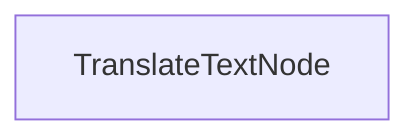

# Processus de Traduction en Batch

Ce projet démontre une implémentation de traitement en batch qui permet aux LLMs de traduire des documents dans plusieurs langues simultanément. Il est conçu pour gérer efficacement la traduction de fichiers markdown tout en préservant la mise en forme.

## Fonctionnalités

- Traduit le contenu markdown dans plusieurs langues en parallèle
- Enregistre les fichiers traduits dans un répertoire de sortie spécifié

## Mise en route

1. Installez les packages requis :
```bash
pip install -r requirements.txt
```

2. Configurez votre clé API :
```bash
export ANTHROPIC_API_KEY="votre-clé-api-ici"
```

3. Exécutez le processus de traduction :
```bash
python main.py
```

## Fonctionnement

L'implémentation utilise un `TranslateTextNode` qui traite des lots de requêtes de traduction :



Le `TranslateTextNode` :
1. Prépare des lots pour des traductions dans plusieurs langues
2. Exécute les traductions en parallèle en utilisant le modèle
3. Enregistre le contenu traduit dans des fichiers individuels
4. Maintient la structure d'origine du markdown

Cette approche illustre comment PocketFlow peut traiter efficacement plusieurs tâches connexes en parallèle.

## Exemple de sortie

Lorsque vous exécutez le processus de traduction, vous verrez une sortie similaire à celle-ci :

```
Texte traduit en chinois
Texte traduit en espagnol
Texte traduit en japonais
Texte traduit en allemand
Texte traduit en russe
Texte traduit en portugais
Texte traduit en français
Texte traduit en coréen
Traduction enregistrée dans translations/README_CHINESE.md
Traduction enregistrée dans translations/README_SPANISH.md
Traduction enregistrée dans translations/README_JAPANESE.md
Traduction enregistrée dans translations/README_GERMAN.md
Traduction enregistrée dans translations/README_RUSSIAN.md
Traduction enregistrée dans translations/README_PORTUGUESE.md
Traduction enregistrée dans translations/README_FRENCH.md
Traduction enregistrée dans translations/README_KOREAN.md

=== Traduction terminée ===
Traductions enregistrées dans : translations
============================
```

## Fichiers

- [`main.py`](./main.py): Implémentation du nœud de traduction en batch
- [`utils.py`](./utils.py): Enveloppe simple pour appeler le modèle Anthropic
- [`requirements.txt`](./requirements.txt): Dépendances du projet

Les traductions sont enregistrées dans le répertoire `translations`, chaque fichier étant nommé selon la langue cible.