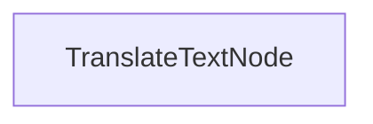

# Batch-Übersetzungsvorgang

Dieses Projekt demonstriert eine Batch-Verarbeitungsimplementierung, die es künstlichen Intelligenzen ermöglicht, Dokumente zeitgleich in mehrere Sprachen zu übersetzen. Es ist darauf ausgelegt, die Übersetzung von Markdown-Dateien effizient zu verarbeiten, während das Format beibehalten wird.

## Funktionen

- Übersetzt Inhalt in Markdown-Format parallel in mehrere Sprachen
- Speichert die übersetzten Dateien in dem angegebenen Ausgabeverzeichnis

## Erste Schritte

1. Installieren Sie die erforderlichen Pakete:
```bash
pip install -r requirements.txt
```

2. Setzen Sie Ihren API-Schlüssel:
```bash
export ANTHROPIC_API_KEY="your-api-key-here"
```

3. Führen Sie den Übersetzungsvorgang aus:
```bash
python main.py
```

## Funktionsweise

Die Implementierung nutzt einen `TranslateTextNode`, der Batches von Übersetzungsanfragen verarbeitet:



Der `TranslateTextNode`:
1. Bereitet Batches für Übersetzungen in mehrere Sprachen vor
2. Führt die Übersetzungen parallel unter Verwendung des Modells durch
3. Speichert den übersetzten Inhalt in individuelle Dateien
4. Behält die ursprüngliche Markdown-Struktur bei

Dieses Vorgehen zeigt, wie PocketFlow effizient mehrere verwandte Aufgaben parallel verarbeiten kann.

## Beispiel-Ausgabe

Wenn Sie den Übersetzungsvorgang ausführen, sehen Sie eine Ausgabe, die diesem ähnelt:

```
Übersetzt chinesischer Text
Übersetzt spanischer Text
Übersetzt japanischer Text
Übersetzt deutscher Text
Übersetzt russischer Text
Übersetzt portugiesischer Text
Übersetzt französischer Text
Übersetzt koreanischer Text
Übersetzung gespeichert in translations/README_CHINESE.md
Übersetzung gespeichert in translations/README_SPANISH.md
Übersetzung gespeichert in translations/README_JAPANESE.md
Übersetzung gespeichert in translations/README_GERMAN.md
Übersetzung gespeichert in translations/README_RUSSIAN.md
Übersetzung gespeichert in translations/README_PORTUGUESE.md
Übersetzung gespeichert in translations/README_FRENCH.md
Übersetzung gespeichert in translations/README_KOREAN.md

=== Übersetzung abgeschlossen ===
Übersetzungen gespeichert in: translations
============================
```

## Dateien

- [`main.py`](./main.py): Implementierung des Batch-Übersetzungs-Knotens
- [`utils.py`](./utils.py): Einfache Wrapper für den Aufruf des Anthropics-Modells
- [`requirements.txt`](./requirements.txt): Projektabhängigkeiten

Die Übersetzungen werden im Verzeichnis `translations` gespeichert, wobei jede Datei nach der ZielSprache benannt ist.