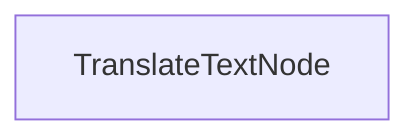

# バッチ翻訳プロセス

このプロジェクトは、ドキュメントを複数言語に同時に翻訳するためのバッチ処理実装を示しています。これは、マークダウンファイルの翻訳を効率的に行いながら、フォーマットを保持することを目的として設計されています。

## 特徴

- マークダウンの内容を複数言語に並列して翻訳
- 翻訳したファイルを指定された出力ディレクトリに保存

## はじめに

1. 必要なパッケージをインストールします:
```bash
pip install -r requirements.txt
```

2. APIキーをセットアップします:
```bash
export ANTHROPIC_API_KEY="your-api-key-here"
```

3. 翻訳プロセスを実行します:
```bash
python main.py
```

## 動作方法

この実装では、翻訳リクエストのバッチを処理する `TranslateTextNode` を使用しています:



`TranslateTextNode`:
1. 複数言語への翻訳用バッチの準備
2. モデルを使用して並列で翻訳を実行
3. 翻訳した内容を個別のファイルに保存
4. 元のマークダウン構造を維持

このアプローチは、PocketFlowが複数の関連タスクを並列で効率的に処理する方法を示しています。

## 例の出力

翻訳プロセスを実行すると、次のようになるはずです:

```
中国語の翻訳テキスト
スペイン語の翻訳テキスト
日本語の翻訳テキスト
ドイツ語の翻訳テキスト
ロシア語の翻訳テキスト
ポルトガル語の翻訳テキスト
フランス語の翻訳テキスト
韓国語の翻訳テキスト
翻訳を translations/README_CHINESE.md に保存
翻訳を translations/README_SPANISH.md に保存
翻訳を translations/README_JAPANESE.md に保存
翻訳を translations/README_GERMAN.md に保存
翻訳を translations/README_RUSSIAN.md に保存
翻訳を translations/README_PORTUGUESE.md に保存
翻訳を translations/README_FRENCH.md に保存
翻訳を translations/README_KOREAN.md に保存

=== 翻訳完了 ===
翻訳は次の場所に保存されました: translations
============================
```

## ファイル

- [`main.py`](./main.py): バッチ翻訳ノードの実装
- [`utils.py`](./utils.py): Anthropicモデルの呼び出し用ラッパー
- [`requirements.txt`](./requirements.txt): プロジェクトの依存関係

翻訳は `translations` ディレクトリに保存され、各ファイルは対象言語に応じて名付けられます。