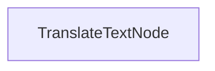

# 배치 번역 프로세스

이 프로젝트는 문서를 동시에 여러 언어로 번역할 수 있는 배치 처리 구현을 전시합니다. 이는 마크다운 파일의 번역을 효율적으로 처리하면서 형식을 유지하도록 설계되었습니다.

## 기능

- 여러 언어로 마크다운 내용을 병렬로 번역
- 번역된 파일을 지정된 출력 디렉토리에 저장

## 시작하기

1. 필요한 패키지를 설치하세요:
```bash
pip install -r requirements.txt
```

2. API 키를 설정하세요:
```bash
export ANTHROPIC_API_KEY="your-api-key-here"
```

3. 번역 프로세스를 실행하세요:
```bash
python main.py
```

## 작동 방식

이 구현은 번역 요청 배치를 처리하는 `TranslateTextNode`를 사용합니다:



`TranslateTextNode`는 다음과 같이 작동합니다:
1. 여러 언어 번역을 위한 배치를 준비합니다
2. 모델을 사용하여 번역을 병렬로 수행합니다
3. 번역된 내용을 개별 파일에 저장합니다
4. 원래의 마크다운 구조를 유지합니다

이 접근법은 PocketFlow가 여러 관련 작업을 효율적으로 병렬로 처리할 수 있음을 보여줍니다.

## 예제 출력

번역 프로세스를 실행하면 다음과 유사한 출력을 볼 수 있습니다:

```
중국어 번역 텍스트
스페인어 번역 텍스트
일본어 번역 텍스트
독일어 번역 텍스트
러시아어 번역 텍스트
포르투갈어 번역 텍스트
프랑스어 번역 텍스트
한국어 번역 텍스트
번역 저장 위치: translations/README_CHINESE.md
번역 저장 위치: translations/README_SPANISH.md
번역 저장 위치: translations/README_JAPANESE.md
번역 저장 위치: translations/README_GERMAN.md
번역 저장 위치: translations/README_RUSSIAN.md
번역 저장 위치: translations/README_PORTUGUESE.md
번역 저장 위치: translations/README_FRENCH.md
번역 저장 위치: translations/README_KOREAN.md

=== 번역 완료 ===
번역 저장 위치: translations
============================
```

## 파일

- [`main.py`](./main.py): 배치 번역 노드 구현
- [`utils.py`](./utils.py): Anthropic 모델을 호출하기 위한 간단한 래퍼
- [`requirements.txt`](./requirements.txt): 프로젝트 의존성

번역은 `translations` 디렉토리에 저장되며, 각 파일은 대상 언어에 따라 이름이 지정됩니다.