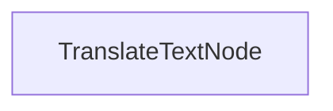

# Processo de Tradução em Lote

Este projeto demonstra uma implementação de processamento em lote que permite que os LLMs traduzam documentos para múltiplos idiomas simultaneamente. Está projetado para manipular eficientemente a tradução de arquivos markdown enquanto preserva a formatação.

## Recursos

- Traduz conteúdo markdown para múltiplos idiomas em paralelo
- Salva os arquivos traduzidos no diretório de saída especificado

## Começando

1. Instale os pacotes necessários:
```bash
pip install -r requirements.txt
```

2. Configure sua chave API:
```bash
export ANTHROPIC_API_KEY="your-api-key-here"
```

3. Execute o processo de tradução:
```bash
python main.py
```

## Como Funciona

A implementação utiliza um `TranslateTextNode` que processa lotes de solicitações de tradução:



O `TranslateTextNode`:
1. Prepara lotes para traduções em múltiplos idiomas
2. Executa as traduções em paralelo usando o modelo
3. Salva o conteúdo traduzido em arquivos individuais
4. Mantém a estrutura original do markdown

Esta abordagem demonstra como o PocketFlow pode processar eficientemente múltiplas tarefas relacionadas em paralelo.

## Saída de Exemplo

Quando você executa o processo de tradução, verá uma saída semelhante a esta:

```
Texto traduzido para chinês
Texto traduzido para espanhol
Texto traduzido para japonês
Texto traduzido para alemão
Texto traduzido para russo
Texto traduzido para português
Texto traduzido para francês
Texto traduzido para coreano
Tradução salva em translations/README_CHINESE.md
Tradução salva em translations/README_SPANISH.md
Tradução salva em translations/README_JAPANESE.md
Tradução salva em translations/README_GERMAN.md
Tradução salva em translations/README_RUSSIAN.md
Tradução salva em translations/README_PORTUGUESE.md
Tradução salva em translations/README_FRENCH.md
Tradução salva em translations/README_KOREAN.md

=== Tradução Completa ===
Traduções salvas em: translations
============================
```

## Arquivos

- [`main.py`](./main.py): Implementação do nó de tradução em lote
- [`utils.py`](./utils.py): Wrapper simples para chamar o modelo Anthropic
- [`requirements.txt`](./requirements.txt): Dependências do projeto

As traduções são salvas no diretório `translations`, com cada arquivo nomeado de acordo com o idioma de destino.