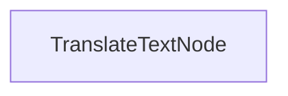

# Процесс партиционного перевода

Этот проект демонстрирует реализацию партиционной обработки, которая позволяет моделям языкового моделирования одновременно переводить документы на несколько языков. Он разработан для эффективной обработки перевода markdown-файлов, сохраняя форматирование.

## Возможности

- Параллельный перевод содержимого markdown на несколько языков
- Сохранение переведенных файлов в указанную директорию вывода

## Начало работы

1. Установите необходимые пакеты:
```bash
pip install -r requirements.txt
```

2. Настройте ваш API-ключ:
```bash
export ANTHROPIC_API_KEY="your-api-key-here"
```

3. Запустите процесс перевода:
```bash
python main.py
```

## Как это работает

Реализация использует `TranslateTextNode`, который обрабатывает партии запросов на перевод:



`TranslateTextNode`:
1. Подготавливает партии для перевода на несколько языков
2. Выполняет переводы параллельно с использованием модели
3. Сохраняет переведенное содержимое в отдельные файлы
4. Сохраняет оригинальную структуру markdown

Этот подход демонстрирует, как PocketFlow может эффективно обрабатывать несколько связанных задач параллельно.

## Пример вывода

При запуске процесса перевода вы увидите вывод, похожий на этот:

```
Переведенный текст на китайском
Переведенный текст на испанском
Переведенный текст на японском
Переведенный текст на немецком
Переведенный текст на русском
Переведенный текст на португальском
Переведенный текст на французском
Переведенный текст на корейском
Сохранен перевод в translations/README_CHINESE.md
Сохранен перевод в translations/README_SPANISH.md
Сохранен перевод в translations/README_JAPANESE.md
Сохранен перевод в translations/README_GERMAN.md
Сохранен перевод в translations/README_RUSSIAN.md
Сохранен перевод в translations/README_PORTUGUESE.md
Сохранен перевод в translations/README_FRENCH.md
Сохранен перевод в translations/README_KOREAN.md

=== Перевод завершен ===
Переводы сохранены в: translations
============================
```

## Файлы

- [`main.py`](./main.py): Реализация узла партиционного перевода
- [`utils.py`](./utils.py): Простая оболочка для вызова модели Anthropic
- [`requirements.txt`](./requirements.txt): Зависимости проекта

Переводы сохраняются в директорию `translations`, с каждым файлом, названным согласно целевому языку.