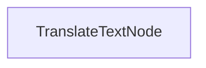

<<<<<<< HEAD
# Proceso de Traducción por Lotes

Este proyecto demuestra una implementación de procesamiento por lotes que permite a los LLMs traducir documentos a múltiples idiomas simultáneamente. Está diseñado para manejar eficientemente la traducción de archivos markdown mientras preserva el formato.
=======
<div align="center">
  
</div>

<!-- [English](https://github.com/The-Pocket/PocketFlow/blob/main/README.md) -->

[English](https://github.com/The-Pocket/PocketFlow/blob/main/README.md) | [中文](https://github.com/The-Pocket/PocketFlow/blob/main/cookbook/pocketflow-batch/translations/README_CHINESE.md) | Español | [日本語](https://github.com/The-Pocket/PocketFlow/blob/main/cookbook/pocketflow-batch/translations/README_JAPANESE.md) | [Deutsch](https://github.com/The-Pocket/PocketFlow/blob/main/cookbook/pocketflow-batch/translations/README_GERMAN.md) | [Русский](https://github.com/The-Pocket/PocketFlow/blob/main/cookbook/pocketflow-batch/translations/README_RUSSIAN.md) | [Português](https://github.com/The-Pocket/PocketFlow/blob/main/cookbook/pocketflow-batch/translations/README_PORTUGUESE.md) | [Français](https://github.com/The-Pocket/PocketFlow/blob/main/cookbook/pocketflow-batch/translations/README_FRENCH.md) | [한국어](https://github.com/The-Pocket/PocketFlow/blob/main/cookbook/pocketflow-batch/translations/README_KOREAN.md)
>>>>>>> 5e3b529b8f8440220020c1bde2b1fb017e12d342

## Características

<<<<<<< HEAD
- Traduce contenido markdown a múltiples idiomas en paralelo
- Guarda los archivos traducidos en un directorio de salida especificado

## Empezando

1. Instala los paquetes necesarios:
```bash
pip install -r requirements.txt
```

2. Configura tu clave API:
```bash
export ANTHROPIC_API_KEY="tu-clave-api-aquí"
```

3. Ejecuta el proceso de traducción:
```bash
python main.py
```
=======
Pocket Flow es un framework minimalista de LLM de [100 líneas](https://github.com/The-Pocket/PocketFlow/blob/main/pocketflow/__init__.py)

- **Ligero**: Solo 100 líneas. Cero hinchazón, cero dependencias, cero vinculación a proveedores.
  
- **Expresivo**: Todo lo que amas—([Multi-](https://the-pocket.github.io/PocketFlow/design_pattern/multi_agent.html))[Agentes](https://the-pocket.github.io/PocketFlow/design_pattern/agent.html), [Flujo de Trabajo](https://the-pocket.github.io/PocketFlow/design_pattern/workflow.html), [RAG](https://the-pocket.github.io/PocketFlow/design_pattern/rag.html), y más.

- **[Programación mediante Agentes](https://zacharyhuang.substack.com/p/agentic-coding-the-most-fun-way-to)**: Permite que los Agentes de IA (por ejemplo, Cursor AI) construyan Agentes—¡multiplicando la productividad por 10!

Comienza con Pocket Flow:
- Para instalar, ```pip install pocketflow``` o simplemente copia el [código fuente](https://github.com/The-Pocket/PocketFlow/blob/main/pocketflow/__init__.py) (solo 100 líneas).
- Para aprender más, consulta la [documentación](https://the-pocket.github.io/PocketFlow/). Para conocer la motivación, lee la [historia](https://zacharyhuang.substack.com/p/i-built-an-llm-framework-in-just).
- ¿Tienes preguntas? Consulta este [Asistente de IA](https://chatgpt.com/g/g-677464af36588191b9eba4901946557b-pocket-flow-assistant), o [¡crea un issue!](https://github.com/The-Pocket/PocketFlow/issues/new)
- 🎉 ¡Únete a nuestro [Discord](https://discord.gg/hUHHE9Sa6T) para conectar con otros desarrolladores construyendo con Pocket Flow!
- 🎉 Pocket Flow inicialmente está en Python, ¡pero ahora tenemos versiones en [Typescript](https://github.com/The-Pocket/PocketFlow-Typescript), [Java](https://github.com/The-Pocket/PocketFlow-Java), [C++](https://github.com/The-Pocket/PocketFlow-CPP) y [Go](https://github.com/The-Pocket/PocketFlow-Go)!
>>>>>>> 5e3b529b8f8440220020c1bde2b1fb017e12d342

## Cómo Funciona

<<<<<<< HEAD
La implementación utiliza un `TranslateTextNode` que procesa lotes de solicitudes de traducción:
=======
Los frameworks actuales de LLM están sobrecargados... ¡Solo necesitas 100 líneas para un framework de LLM!
>>>>>>> 5e3b529b8f8440220020c1bde2b1fb017e12d342



El `TranslateTextNode`:
1. Prepara lotes para traducciones a múltiples idiomas
2. Ejecuta las traducciones en paralelo utilizando el modelo
3. Guarda el contenido traducido en archivos individuales
4. Mantiene la estructura original del markdown

<<<<<<< HEAD
Esta aproximación demuestra cómo PocketFlow puede procesar eficientemente múltiples tareas relacionadas en paralelo.
=======
  |                | **Abstracción**          | **Envolturas Específicas de Aplicación**                                      | **Envolturas Específicas de Proveedor**                                    | **Líneas**       | **Tamaño**    |
|----------------|:-----------------------------: |:-----------------------------------------------------------:|:------------------------------------------------------------:|:---------------:|:----------------------------:|
| LangChain  | Agente, Cadena               | Muchas <br><sup><sub>(p.ej., QA, Resumen)</sub></sup>              | Muchas <br><sup><sub>(p.ej., OpenAI, Pinecone, etc.)</sub></sup>                   | 405K          | +166MB                     |
| CrewAI     | Agente, Cadena            | Muchas <br><sup><sub>(p.ej., FileReadTool, SerperDevTool)</sub></sup>         | Muchas <br><sup><sub>(p.ej., OpenAI, Anthropic, Pinecone, etc.)</sub></sup>        | 18K           | +173MB                     |
| SmolAgent   | Agente                      | Algunas <br><sup><sub>(p.ej., CodeAgent, VisitWebTool)</sub></sup>         | Algunas <br><sup><sub>(p.ej., DuckDuckGo, Hugging Face, etc.)</sub></sup>           | 8K            | +198MB                     |
| LangGraph   | Agente, Grafo           | Algunas <br><sup><sub>(p.ej., Búsqueda Semántica)</sub></sup>                     | Algunas <br><sup><sub>(p.ej., PostgresStore, SqliteSaver, etc.) </sub></sup>        | 37K           | +51MB                      |
| AutoGen    | Agente                | Algunas <br><sup><sub>(p.ej., Tool Agent, Chat Agent)</sub></sup>              | Muchas <sup><sub>[Opcional]<br> (p.ej., OpenAI, Pinecone, etc.)</sub></sup>        | 7K <br><sup><sub>(solo-núcleo)</sub></sup>    | +26MB <br><sup><sub>(solo-núcleo)</sub></sup>          |
| **PocketFlow** | **Grafo**                    | **Ninguna**                                                 | **Ninguna**                                                  | **100**       | **+56KB**                  |
>>>>>>> 5e3b529b8f8440220020c1bde2b1fb017e12d342

## Ejemplo de Salida

Cuando ejecutes el proceso de traducción, verás una salida similar a esta:

<<<<<<< HEAD
```
Texto traducido al chino
Texto traducido al español
Texto traducido al japonés
Texto traducido al alemán
Texto traducido al ruso
Texto traducido al portugués
Texto traducido al francés
Texto traducido al coreano
Traducción guardada en translations/README_CHINESE.md
Traducción guardada en translations/README_SPANISH.md
Traducción guardada en translations/README_JAPANESE.md
Traducción guardada en translations/README_GERMAN.md
Traducción guardada en translations/README_RUSSIAN.md
Traducción guardada en translations/README_PORTUGUESE.md
Traducción guardada en translations/README_FRENCH.md
Traducción guardada en translations/README_KOREAN.md

=== Traducción Completa ===
Traducciones guardadas en: translations
============================
```

## Archivos
=======
Las [100 líneas](https://github.com/The-Pocket/PocketFlow/blob/main/pocketflow/__init__.py) capturan la abstracción principal de los frameworks de LLM: ¡el Grafo!
<br>
<div align="center">
  
</div>
<br>

A partir de ahí, es fácil implementar patrones de diseño populares como ([Multi-](https://the-pocket.github.io/PocketFlow/design_pattern/multi_agent.html))[Agentes](https://the-pocket.github.io/PocketFlow/design_pattern/agent.html), [Flujo de Trabajo](https://the-pocket.github.io/PocketFlow/design_pattern/workflow.html), [RAG](https://the-pocket.github.io/PocketFlow/design_pattern/rag.html), etc.
<br>
<div align="center">
  
</div>
<br>
✨ A continuación se presentan tutoriales básicos:

<div align="center">
  
|  Nombre  | Dificultad    |  Descripción  |  
| :-------------:  | :-------------: | :--------------------- |  
| [Chat](https://github.com/The-Pocket/PocketFlow/tree/main/cookbook/pocketflow-chat) | ☆☆☆ <br> *Principiante*   | Un chatbot básico con historial de conversación |
| [Salida Estructurada](https://github.com/The-Pocket/PocketFlow/tree/main/cookbook/pocketflow-structured-output) | ☆☆☆ <br> *Principiante* | Extracción de datos estructurados de currículums mediante prompts |
| [Flujo de Trabajo](https://github.com/The-Pocket/PocketFlow/tree/main/cookbook/pocketflow-workflow) | ☆☆☆ <br> *Principiante*   | Un flujo de escritura que esquematiza, escribe contenido y aplica estilo |
| [Agente](https://github.com/The-Pocket/PocketFlow/tree/main/cookbook/pocketflow-agent) | ☆☆☆ <br> *Principiante*   | Un agente de investigación que puede buscar en la web y responder preguntas |
| [RAG](https://github.com/The-Pocket/PocketFlow/tree/main/cookbook/pocketflow-rag) | ☆☆☆ <br> *Principiante*   | Un simple proceso de Generación aumentada por Recuperación |
| [Procesamiento por Lotes](https://github.com/The-Pocket/PocketFlow/tree/main/cookbook/pocketflow-batch) | ☆☆☆ <br> *Principiante* | Un procesador por lotes que traduce contenido markdown a múltiples idiomas |
| [Streaming](https://github.com/The-Pocket/PocketFlow/tree/main/cookbook/pocketflow-llm-streaming) | ☆☆☆ <br> *Principiante*   | Una demostración de streaming LLM en tiempo real con capacidad de interrupción del usuario |
| [Protección de Chat](https://github.com/The-Pocket/PocketFlow/tree/main/cookbook/pocketflow-chat-guardrail) | ☆☆☆ <br> *Principiante*  | Un chatbot asesor de viajes que solo procesa consultas relacionadas con viajes |
| [Map-Reduce](https://github.com/The-Pocket/PocketFlow/tree/main/cookbook/pocketflow-map-reduce) | ★☆☆ <br> *Inicial* | Un procesador de calificación de currículums que utiliza el patrón map-reduce para evaluación por lotes |
| [Multi-Agente](https://github.com/The-Pocket/PocketFlow/tree/main/cookbook/pocketflow-multi-agent) | ★☆☆ <br> *Inicial* | Un juego de palabras Tabú para comunicación asíncrona entre dos agentes |
| [Supervisor](https://github.com/The-Pocket/PocketFlow/tree/main/cookbook/pocketflow-supervisor) | ★☆☆ <br> *Inicial* | El agente de investigación se vuelve poco fiable... Construyamos un proceso de supervisión|
| [Paralelo](https://github.com/The-Pocket/PocketFlow/tree/main/cookbook/pocketflow-parallel-batch) | ★☆☆ <br> *Inicial*   | Una demostración de ejecución paralela que muestra una aceleración de 3x |
| [Flujo Paralelo](https://github.com/The-Pocket/PocketFlow/tree/main/cookbook/pocketflow-parallel-batch-flow) | ★☆☆ <br> *Inicial*   | Una demostración de procesamiento de imágenes en paralelo que muestra una aceleración de 8x con múltiples filtros |
| [Voto por Mayoría](https://github.com/The-Pocket/PocketFlow/tree/main/cookbook/pocketflow-majority-vote) | ★☆☆ <br> *Inicial* | Mejora de la precisión del razonamiento mediante la agregación de múltiples intentos de solución |
| [Pensamiento](https://github.com/The-Pocket/PocketFlow/tree/main/cookbook/pocketflow-thinking) | ★☆☆ <br> *Inicial*   | Resolver problemas de razonamiento complejos a través de Cadena de Pensamiento |
| [Memoria](https://github.com/The-Pocket/PocketFlow/tree/main/cookbook/pocketflow-chat-memory) | ★☆☆ <br> *Inicial* | Un chatbot con memoria a corto y largo plazo |
| [Text2SQL](https://github.com/The-Pocket/PocketFlow/tree/main/cookbook/pocketflow-text2sql) | ★☆☆ <br> *Inicial* | Convertir lenguaje natural a consultas SQL con un bucle de auto-depuración |
| [MCP](https://github.com/The-Pocket/PocketFlow/tree/main/cookbook/pocketflow-mcp) | ★☆☆ <br> *Inicial* | Agente que utiliza el Protocolo de Contexto de Modelo para operaciones numéricas |
| [A2A](https://github.com/The-Pocket/PocketFlow/tree/main/cookbook/pocketflow-a2a) | ★☆☆ <br> *Inicial* | Agente envuelto con protocolo Agente-a-Agente para comunicación entre agentes |
| [Web HITL](https://github.com/The-Pocket/PocketFlow/tree/main/cookbook/pocketflow-web-hitl) | ★☆☆ <br> *Inicial* | Un servicio web mínimo para un bucle de revisión humana con actualizaciones SSE |
>>>>>>> 5e3b529b8f8440220020c1bde2b1fb017e12d342

- [`main.py`](./main.py): Implementación del nodo de traducción por lotes
- [`utils.py`](./utils.py): Envoltorio simple para llamar al modelo Anthropic
- [`requirements.txt`](./requirements.txt): Dependencias del proyecto

<<<<<<< HEAD
Las traducciones se guardan en el directorio `translations`, con cada archivo nombrado según el idioma de destino.
=======
👀 ¿Quieres ver otros tutoriales para principiantes? [¡Crea un issue!](https://github.com/The-Pocket/PocketFlow/issues/new)

## ¿Cómo usar Pocket Flow?

🚀 A través de la **Programación mediante Agentes**—el paradigma de desarrollo de aplicaciones LLM más rápido- donde *los humanos diseñan* y *los agentes programan*!

<br>
<div align="center">
  <a href="https://zacharyhuang.substack.com/p/agentic-coding-the-most-fun-way-to" target="_blank">
    
  </a>
</div>
<br>

✨ A continuación hay ejemplos de aplicaciones LLM más complejas:

<div align="center">
  
|  Nombre de la App     |  Dificultad    | Temas  | Diseño Humano | Código del Agente |
| :-------------:  | :-------------: | :---------------------: |  :---: |  :---: |
| [Construir Cursor con Cursor](https://github.com/The-Pocket/Tutorial-Cursor) <br> <sup><sub>Pronto alcanzaremos la singularidad ...</sup></sub> | ★★★ <br> *Avanzado*   | [Agente](https://the-pocket.github.io/PocketFlow/design_pattern/agent.html) | [Doc de Diseño](https://github.com/The-Pocket/Tutorial-Cursor/blob/main/docs/design.md) | [Código de Flujo](https://github.com/The-Pocket/Tutorial-Cursor/blob/main/flow.py)
| [Constructor de Conocimiento de Código Base](https://github.com/The-Pocket/Tutorial-Codebase-Knowledge) <br> <sup><sub>La vida es demasiado corta para mirar el código de otros con confusión</sup></sub> |  ★★☆ <br> *Medio* | [Flujo de Trabajo](https://the-pocket.github.io/PocketFlow/design_pattern/workflow.html) | [Doc de Diseño](https://github.com/The-Pocket/Tutorial-Codebase-Knowledge/blob/main/docs/design.md) | [Código de Flujo](https://github.com/The-Pocket/Tutorial-Codebase-Knowledge/blob/main/flow.py)
| [Pregunta a AI Paul Graham](https://github.com/The-Pocket/Tutorial-YC-Partner) <br> <sup><sub>Pregunta a AI Paul Graham, en caso de que no entres</sup></sub> | ★★☆ <br> *Medio*  | [RAG](https://the-pocket.github.io/PocketFlow/design_pattern/rag.html) <br> [Map Reduce](https://the-pocket.github.io/PocketFlow/design_pattern/mapreduce.html) <br> [TTS](https://the-pocket.github.io/PocketFlow/utility_function/text_to_speech.html) | [Doc de Diseño](https://github.com/The-Pocket/Tutorial-AI-Paul-Graham/blob/main/docs/design.md) | [Código de Flujo](https://github.com/The-Pocket/Tutorial-AI-Paul-Graham/blob/main/flow.py)
| [Resumidor de Youtube](https://github.com/The-Pocket/Tutorial-Youtube-Made-Simple)  <br> <sup><sub> Explica videos de YouTube como si tuvieras 5 años </sup></sub> | ★☆☆ <br> *Principiante*   | [Map Reduce](https://the-pocket.github.io/PocketFlow/design_pattern/mapreduce.html) |  [Doc de Diseño](https://github.com/The-Pocket/Tutorial-Youtube-Made-Simple/blob/main/docs/design.md) | [Código de Flujo](https://github.com/The-Pocket/Tutorial-Youtube-Made-Simple/blob/main/flow.py)
| [Generador de Introducción para Email Frío](https://github.com/The-Pocket/Tutorial-Cold-Email-Personalization)  <br> <sup><sub> Rompehielos instantáneos que convierten leads fríos en calientes </sup></sub> | ★☆☆ <br> *Principiante*   | [Map Reduce](https://the-pocket.github.io/PocketFlow/design_pattern/mapreduce.html) <br> [Búsqueda Web](https://the-pocket.github.io/PocketFlow/utility_function/websearch.html) |  [Doc de Diseño](https://github.com/The-Pocket/Tutorial-Cold-Email-Personalization/blob/master/docs/design.md) | [Código de Flujo](https://github.com/The-Pocket/Tutorial-Cold-Email-Personalization/blob/master/flow.py)

</div>

- ¿Quieres aprender **Programación mediante Agentes**?

  - ¡Consulta [mi YouTube](https://www.youtube.com/@ZacharyLLM?sub_confirmation=1) para ver tutoriales en video sobre cómo se crearon algunas de las aplicaciones anteriores!

  - ¿Quieres construir tu propia aplicación LLM? ¡Lee este [post](https://zacharyhuang.substack.com/p/agentic-coding-the-most-fun-way-to)! ¡Comienza con [esta plantilla](https://github.com/The-Pocket/PocketFlow-Template-Python)!
>>>>>>> 5e3b529b8f8440220020c1bde2b1fb017e12d342
