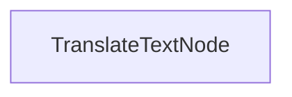

# Proceso de Traducción por Lotes

Este proyecto demuestra una implementación de procesamiento por lotes que permite a los LLMs traducir documentos a múltiples idiomas simultáneamente. Está diseñado para manejar eficientemente la traducción de archivos markdown mientras preserva el formato.

## Características

- Traduce contenido markdown a múltiples idiomas en paralelo
- Guarda los archivos traducidos en un directorio de salida especificado

## Empezando

1. Instala los paquetes necesarios:
```bash
pip install -r requirements.txt
```

2. Configura tu clave API:
```bash
export ANTHROPIC_API_KEY="tu-clave-api-aquí"
```

3. Ejecuta el proceso de traducción:
```bash
python main.py
```

## Cómo Funciona

La implementación utiliza un `TranslateTextNode` que procesa lotes de solicitudes de traducción:



El `TranslateTextNode`:
1. Prepara lotes para traducciones a múltiples idiomas
2. Ejecuta las traducciones en paralelo utilizando el modelo
3. Guarda el contenido traducido en archivos individuales
4. Mantiene la estructura original del markdown

Esta aproximación demuestra cómo PocketFlow puede procesar eficientemente múltiples tareas relacionadas en paralelo.

## Ejemplo de Salida

Cuando ejecutes el proceso de traducción, verás una salida similar a esta:

```
Texto traducido al chino
Texto traducido al español
Texto traducido al japonés
Texto traducido al alemán
Texto traducido al ruso
Texto traducido al portugués
Texto traducido al francés
Texto traducido al coreano
Traducción guardada en translations/README_CHINESE.md
Traducción guardada en translations/README_SPANISH.md
Traducción guardada en translations/README_JAPANESE.md
Traducción guardada en translations/README_GERMAN.md
Traducción guardada en translations/README_RUSSIAN.md
Traducción guardada en translations/README_PORTUGUESE.md
Traducción guardada en translations/README_FRENCH.md
Traducción guardada en translations/README_KOREAN.md

=== Traducción Completa ===
Traducciones guardadas en: translations
============================
```

## Archivos

- [`main.py`](./main.py): Implementación del nodo de traducción por lotes
- [`utils.py`](./utils.py): Envoltorio simple para llamar al modelo Anthropic
- [`requirements.txt`](./requirements.txt): Dependencias del proyecto

Las traducciones se guardan en el directorio `translations`, con cada archivo nombrado según el idioma de destino.